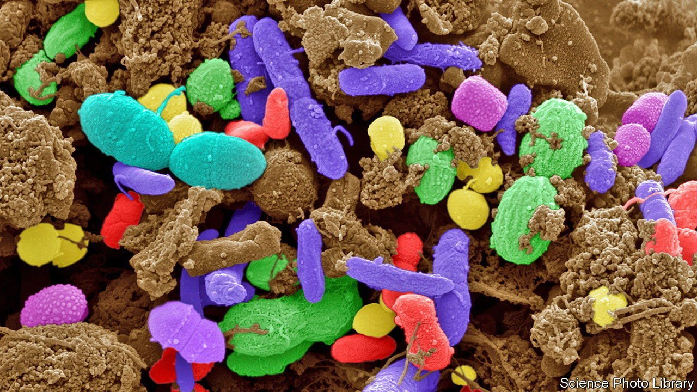

###### Autism

# Can an upset gut microbiome cause autism? 

##### The latest evidence suggests not 

 

> Nov 17th 2021 

THE GUT microbiome’s effect on health is so big that it is sometimes referred to as a forgotten organ. The trillions of critters in the lower alimentary canal have an influence that seems to reach all over the body—helping regulate weight, for example. In recent years, though, one idea in particular has intrigued researchers. This is that certain mixtures of gut microbes may help cause autism.

It is well known that children with autism suffer gastroenteric problems. They often also seem to have simpler gut floras than their neurotypical peers, and some observations report the presence of unusual species. This has led to the suggestion that these abnormal microecosystems might actually be triggering autism. So tempting is this thought that preliminary experiments intended to tweak the microbiomes of autistic children have been carried out, with apparently positive results.


Unfortunately, the theory that gut microbes can cause autism is built on shaky foundations. The best evidence comes from work on mice, which is problematic because identifying murine behaviour patterns that correspond to human autism is as much an art as a science. Work on people, meanwhile, has been criticised for relying on samples too small to yield statistically definitive conclusions.

But no longer. A study published in Cell by Jacob Gratten of the University of Queensland, Australia, and his colleagues is reckoned to have enough statistical power to answer the question robustly. And that answer is “no”, gut microbes do not cause autism. Dr Gratten’s work indicates that, while there is indeed a correlation to be explained, it is actually autism which (albeit indirectly) affects the gut flora, not the other way around.

Dr Gratten and his colleagues embarked on their project in 2016, using stool samples and dietary information collected as part of two large studies, the Australian Autism Biobank and the Queensland Twin Adolescent Brain Project. Of 247 children they selected for inclusion, 99 had been diagnosed with autism, 51 were neurotypical siblings of some of these, and the remainder were unrelated neurotypical children.

There was, they found, a clear connection between individual children’s dietary diversity and the diversity of their gut microbes—with more adventurous diets being associated with richer microbiomes. And since the sensory experiences associated with new foods can be overwhelming to them, autistic children are more likely than others to have restricted diets. Subtracting this effect left no remaining signal. The team thus found no connection between autism and microbial diversity beyond that brought about by autistic children’s food preferences. Nor was there any detectable connection between autism and particular bacterial species of the sort suggested by previous studies.

On the face of things, this is at odds with the findings of the treatment-by-microbiome-tweaking camp, led by Rosa Krajmalnik-Brown of Arizona State University. Her initial studies, admittedly small in number, suggested faecal transplants—used in extreme cases to treat infection with an intestinal bug called Clostridium difficile—had a positive effect on the behavioural traits of children on the autism spectrum, as well as on their gastrointestinal symptoms. She is now supervising clinical trials to test these findings more robustly.

Whether there is really a contradiction remains to be seen. Dr Krajmalnik-Brown, while acknowledging the quality of Dr Gratten’s analysis, still thinks it cannot explain away the results she saw in the preliminary trials. But it is also possible that faecal transplantation, by relieving the uncomfortable symptoms brought about directly by unbalanced microbiomes, improves the behaviour of children with autism, yet does so without affecting the neural underpinnings of the condition. ■

To enjoy more of our mind-expanding science coverage, , our weekly newsletter.

