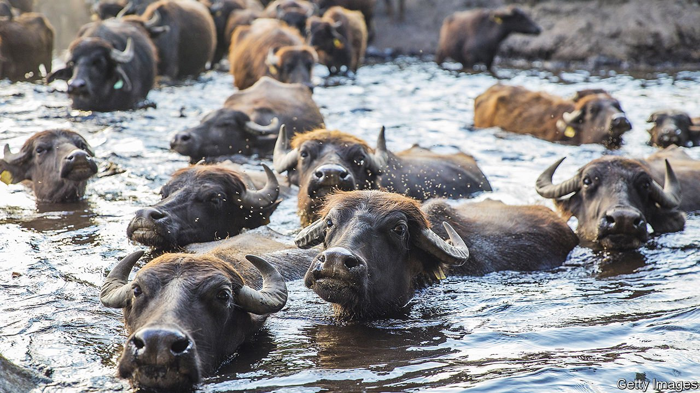
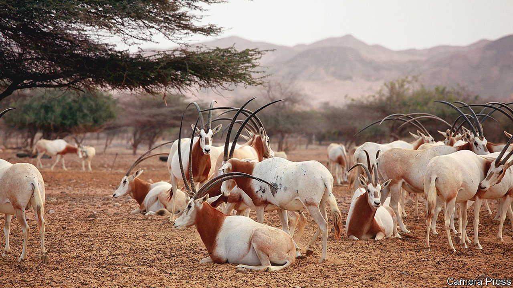

###### Covid animal reservoirs

# Sars-CoV-2 could be lurking in animal hidey-holes 

##### Many animals besides humans look as if they can catch the virus, too 

 

> Nov 18th 2021 

IN THE FIELD of epidemiology, a “spillover” is a virus that has made the leap from one host species to another. The spillovers of most concern to people are those from other animals to Homo sapiens. These may then go on to create “zoonotic” human diseases—of which covid-19 is believed to be one (the original host of SARS-CoV-2 is thought to have been an as-yet-undetermined species of bat).

Such traffic can, however, run in two directions. For example, in 2020 the World Health Organisation reported that SARS-CoV-2 had spilled over in Denmark from human beings into farmed mink, and was thereafter transmitted from animal to animal to create a separate veterinary epidemic. And, earlier this month, a paper posted on BioRxiv, an electronic host for work that has not yet been peer reviewed, presented evidence that the virus is also circulating in white-tailed deer in North America, having presumably spilled over from people there. All of which is on top of reports suggesting that domestic pets, especially cats and dogs, can also pick up SARS-CoV-2—and in the case of cats at least, can then pass it on to others of their kind.


Spillovers of this sort are potentially serious, for two reasons. One is that they create viral reservoirs beyond the easy reach of medical science and monitoring. Even if there are no human cases of covid in an area, such animal reservoirs mean that SARS-CoV-2 may still be lurking, waiting to spill back into people. The other is that exposure to the immune systems of novel hosts may drive the evolution of new and (if they then do spill back) potentially threatening viral strains. The mink incident therefore led the governments of Denmark, the Netherlands and Spain to cull 18m animals and place strict lockdowns in regions around the fur farms concerned. Treating a wild population, such as white-tailed deer, in a similar way would be harder. But precautions are still possible. Raising awareness among those who interact with the deer, such as hunters, can do a lot.

These, though, are reactive approaches. A proactive one would try to establish which species are at greatest risk of becoming reservoirs for SARS-CoV-2 before they actually do so. That would permit the monitoring of threats before they got out of hand. And, as she reports this week in the Proceedings of the Royal Society, Barbara Han of the Cary Institute of Ecosystem Studies, an independent environmental-research organisation based in Millbrook, New York, thinks she has worked out a way to achieve this.

Hidden ACEs

Starting early in 2020, just after covid emerged, Dr Han and her colleagues focused their attention on ACE2, a cell-membrane protein that had been identified almost immediately as the virus’s point of entry. ACE2’s day job is to help regulate blood pressure, and most vertebrates have it in one form or another. The researchers wanted to determine in which other vertebrate species SARS-CoV-2 might be expected to bind as strongly to the local ACE2 receptors as it does to those in human beings. These would be candidates for the role of reservoirs.

To this end, they gathered molecular information about every version of ACE2 that they could get their hands on. Mostly, these were from mammals—142 species of them. They then used computer modelling of the interatomic forces involved to work out the strengths of the bonds likely to develop between SARS-CoV-2’s spike protein and each version of ACE2. As they expected, based on news that broke while they were conducting their work, the bond with mink ACE2 was particularly strong. They found a similarly strong affinity with ACE2 from white-tailed deer, long before reports of infections in that species emerged. Cats and dogs also showed up as being at risk—which reports then confirmed that they were. And gorillas and macaques, which have suffered a few cases in zoos, looked susceptible as well.

Useful as this information was, Dr Han was keen to look beyond these 142 species. To delve deeper, the team built a database of evolutionary traits shared by the species with the most vulnerable ACE2 receptors. This is a technique which has been used successfully in the past on rodents and bats, to assess their likelihood of acting as reservoirs for viruses including Ebola and Zika. It is based on the idea that particular proteins of species with similar physiologies and ways of life might be expected to evolve in similar ways.

The researchers studied everything they could—from breadth of diet, metabolic rate and age of sexual maturity to litter size, lifespan, geographical range and phylogenetic relationships—about more than 5,000 mammals for which little or no ACE2-receptor information was available. This enormous database completed, they fed the outcome into a machine-learning system that had been trained on the characteristics of the 142 species they had already examined. The result was the revelation of 540 species which seemed likely to have vulnerable ACE2 receptors and thus the potential to function as covid reservoirs.

Most primates were on this list—which, considering that people are primates too, was expected. Nor, given suspicions about SARS-CoV-2’s origins, was the inclusion of 35 types of bat a surprise. Surprises, however, there were. Though the common house mouse does not look to be a risk, which is good news, two of its fellow rodents, the ricefield rat and the Malayan field rat, both do. Since these species are often preyed on by domestic cats, themselves now known to be covid-susceptible, that provides a route by which people might become infected.

Dozens of other species were also flagged up as potential reservoirs. These included red foxes and raccoon dogs—two creatures which, like mink, are sometimes farmed for fur—and white-lipped peccaries (pig-like creatures found in South and Central America) and nilgai (a large Asian antelope), both of which are farmed occasionally, and also hunted and eaten.

 


Among more widespread livestock, the species of most concern is the water buffalo. There are reckoned to be over 200m of these around the world, acting as both beasts of burden and sources of milk. And other frequently hunted animals, such as the duiker (another antelope), the warty pig and the mule deer were also reckoned vulnerable, together with some rarities, including two critically endangered antelopes, the addax and the scimitar-horned oryx (pictured below), which was once extinct in the wild and is only now being reintroduced. In these cases the threat is less to human beings than to the survival of the species concerned.

Paying the buffalo bill

The sheer range of species involved staggers Dr Han. “I never imagined that we would ever see a virus with such a high cross-species infection potential,” she says. “It appears that there are at least an order of magnitude more species that are susceptible to SARS-CoV-2 infection than any other zoonotic virus I can think of.”

Forewarned, however, is forearmed. And here there is perhaps a lesson on keeping the weapons in the arsenal sharp. One reason Dr Han’s study took so long from inception to publication is the disparate nature of the sources she needed to draw on. Scattered as they were around the world’s natural-history collections, assembling them took time. Many museums are now in the business of making their collections available electronically. To some, that might sound a low priority. Work like this suggests it is not. ■

Dig deeper

All our stories relating to the pandemic can be found on our . You can also find trackers showing ,  and the virus’s spread across . To enjoy more of our mind-expanding science coverage, , our weekly newsletter.

