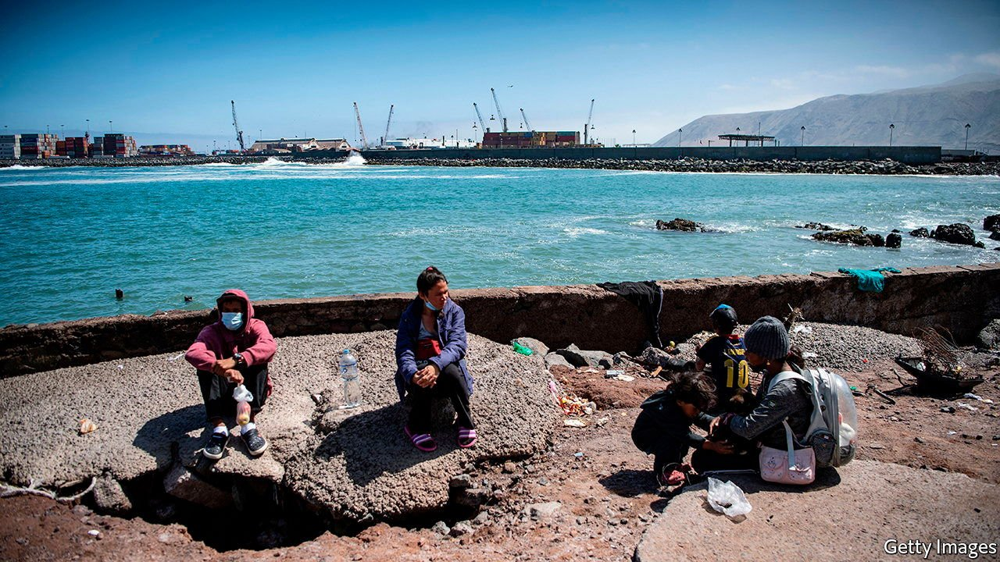

###### Chilly reception

# Chile makes life harder for immigrants 

##### Venezuelans are having a tough time. Haitians have it worse 

 

> Nov 18th 2021 

FOUR YEARS ago Ana Rodríguez, a chemical engineer, fled repression and economic collapse in Venezuela, like millions of her compatriots. At first she settled in neighbouring Colombia. But when she became pregnant she headed to Chile, South America’s most successful economy. In late August this year she and her husband trekked across Bolivia, braved a freezing Andean pass into the country, then hitchhiked across the Atacama desert.

Today they live, without papers, in a tent in Iquique on Chile’s northern coast. It is not what they hoped for. Ms Rodríguez (not her real name) and her husband help café-goers park their cars along the sea wall in exchange for coins. “If you stand still for a moment in Iquique, they humiliate you and call you a murderer, thief or drug-dealer,” says Ms Rodríguez. In September locals marched through the town centre and tossed migrants’ belongings, including toys and nappies, into a fire.


In 2009, 200,000 immigrants lived in Chile. Now nearly 1.5m of its 19m inhabitants are migrants. The largest groups of recent arrivals are Venezuelans and Peruvians. Nearly a half million Venezuelans have arrived over the past five years. Haitians, the third-biggest group, came after an earthquake in 2010. This has caused a backlash, which could affect the outcome of Chile’s presidential . In a small survey of Chileans conducted this year, 60% of respondents said immigration was bad for the country. In 2019 44% thought that.

The official response to Venezuelan migrants has been “schizophrenic”, says Tamara Taraciuk Broner of Human Rights Watch, a pressure group. In 2019 Sebastián Piñera, Chile’s president, travelled to Cúcuta, a Colombian town near the border with Venezuela, to invite that country’s citizens to seek refuge in Chile. He touted a “democratic responsibility visa”, which allows Venezuelans to work and gain access to public services initially for a year, as well as to apply for longer-term residency. Around 90% of Venezuelan children in Chile attend school, a much higher share than in other Latin American countries where their compatriots take refuge.

But requirements for democratic responsibility visas are strict. Venezuelans must submit extensive paperwork, including results of background checks. Chile has issued about 60,000 of these. Four months after Mr Piñera’s trip Chile’s government tightened requirements for issuing tourist visas to Venezuelans. Earlier it had applied the same measure to keep out Haitians. Now citizens of both countries must apply for visas at the Chilean consulate in the country from which they set off. Venezuelans must show that they can spend at least $50 a day. With legal routes to entry nearly closed, partly because of covid, illegal immigration is rising.

Chile has increased deportations of migrants, often without reviewing their cases. Chile’s Supreme Court says the expulsions deny migrants due process and the United Nations has denounced them. Colombia has been far more welcoming to Venezuelans, giving temporary protected status to nearly 2m.

The pandemic, visa restrictions and racism have made it especially hard for Haitians to find work and regularise their status. Since 2019 more have left Chile than have arrived. Some are heading overland to the United States, straining border-security forces throughout the region. In a survey of Haitians crossing into Colombia, carried out by the International Organisation for Migration, 43% of respondents said they had come from Chile. Nearly 100,000 migrants, mostly Haitians, have tried this year to cross the dangerous Darien Gap between Colombia and Panama. Some who made it to the United States in September were promptly deported to Haiti.

As Venezuelans, Ms Rodríguez and her family face less discrimination. But life in Iquique has become intolerable. The family plan to move to Santiago, Chile’s capital. “We have friends there who can help us find jobs,” says Ms Rodríguez. Unless, that is, the government deports them. ■

