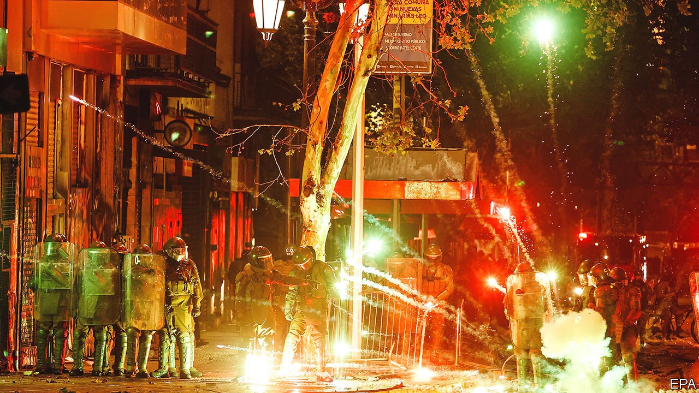
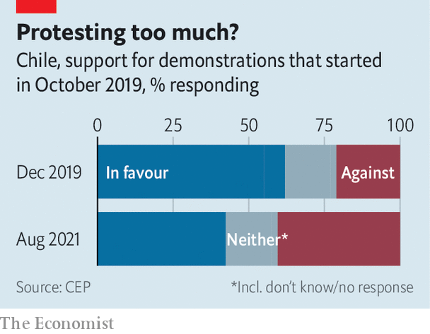

###### Pole positions

# Chile’s presidential election is a contest between extremes 

##### Do voters worry more about crime and immigration, or about inequality and poor public services? 

 

> Nov 18th 2021 

IN OCTOBER 2019 more than a million Chileans took to the streets to demand greater equality and better public services. At least 30 people died in protests that lasted for weeks. To restore calm, Chile’s leaders increased social spending and agreed to a process to rewrite the constitution adopted under Augusto Pinochet, a dictator who ruled from 1973 to 1990. Members of a constitutional convention elected in May this year, many of them leftists and political neophytes, have begun drafting a charter that could transform the country.

Until recently it looked likely that Chile would elect a new president who shares the protesters’ goals. For months Gabriel Boric, a 35-year old former student leader allied with the Communist Party, was the front-runner in a presidential election whose first round takes place on November 21st. (Legislative and regional elections are also scheduled for that day.) Now it seems that the presidential race will be a hard-fought contest between him and a candidate of the far right, José Antonio Kast, who has surged in the polls. A champion of “liberty, the rule of law and the family”, Mr Kast would preserve Pinochet’s low-tax economic model and restore his social conservatism. “Boric represents the demands that gave rise to the protests. But Kast represents what happened two years after, which is that people want peace, order and security,” says Roberto Izikson, the head of Cadem, a polling company.


The summoning of the constitutional convention did not end the upheaval, as Chileans had hoped. On October 18th protesters marked the second anniversary of the demonstrations with more violence. Two people died and hundreds were arrested. Last month the government also declared a state of emergency in southern Chile in response to arson attacks, mostly against logging companies, by some Mapuches, an indigenous group seeking greater autonomy in its ancestral lands. This allows the government to send in the army. On November 9th it extended the emergency after a video appeared on social media that showed heavily armed, hooded men threatening to boot the army out. To many, a rise in immigration looks hardly .

 


Having demanded a new constitution, some Chileans have misgivings. They worry that it will enshrine obligations that the state cannot afford, fuelling inflation, which has recently risen sharply. The constitution may declare Chile to be a “plurinational” state, giving indigenous groups more influence. Trust in the convention fell after the revelation that a far-left member had lied about having cancer, which was a central theme of his campaign. One poll shows that its approval rating has dropped by almost 15 percentage points since July (though it remains more popular than other political institutions).

Mr Boric would put the presidential palace on the side of the protesters and their allies in the constitutional convention. He would scrap the model for public services introduced by the Pinochet regime, which gives private providers a large role. He would forgive all student debt, abolish private pension funds and make public transport free and green. Children as young as 14 would be able to change their gender on documents; schools would be equipped with condom dispensers; “at least” 1% of jobs in the public sector would be reserved for trans people. Mr Boric would raise taxes by a massive eight percentage points of GDP in as few as six years.

There are more moderate candidates among the seven running for the presidency, notably Sebastián Sichel on the centre-right and Yasna Provoste on the centre-left. But they have so far failed to prosper. Slammed for left-wing looniness, Mr Boric himself has become more moderate. He no longer favours an amnesty for illegal immigrants or a requirement that half the members of corporate boards must be workers. But his Communist allies will impede his move to the centre. Although Mr Boric criticised violence on the anniversary of the protests, some of his coalition partners joined the rally.

This gives an opening to Mr Kast, whose remedy for Chile’s woes mixes nationalism, law and order and proposals to slash taxes and regulation. A lawyer who broke with an established party to found his own Republican Party (echoing the name of Donald Trump’s), he proposes to dig ditches on Chile’s northern border to deter undocumented migrants and establish an agency modelled on the United States’ Immigration and Customs Enforcement. Mr Kast denounces the protesters of 2019 as vandals. He wants to beef up the government’s powers during states of emergency. This month he provoked a furore by comparing Pinochet favourably with Nicaragua’s left-wing strongman, Daniel Ortega. (He says his comments were taken out of context.)

A devout Catholic and father of nine children, Mr Kast opposes legalising same-sex marriage and wants to ban abortion (which is legal only in very few cases). Most of all, he opposes the unsettling changes that the protests threaten to bring about. “We’re not going to transform anything radically,” his manifesto declares. If he wins, he may clash with the architects of the new constitution.

There is much in Mr Kast’s conservatism to put voters off. Elderly and low-income voters, who make up his base, like his line on law and order but may be less enthusiastic than he is to restrict the state’s role in providing public services. But he has been deft in persuading hesitant voters that he is not such a scary guy. He puts out self-deprecating TikTok videos. In an interview with a gay leftist YouTuber he jovially rolled a condom onto a banana.

“These elections are the hardest to predict since the return to democracy,” says Carmen Le Foulon, the head of polling at the Centre of Public Studies, a think-tank. After trouncing his opponents in the first two debates Mr Kast faltered in the third, on November 15th. His rivals laid into him for downplaying Pinochet’s crimes, for opposing gay marriage and for sending mixed signals on whether his government would build coal-fired power plants. Mr Kast’s charm deserted him.

That gives new hope to Mr Boric, and perhaps to one of the more moderate candidates. A lot depends on young voters, who were an important factor in the referendum last year that endorsed the rewriting of the constitution. They are likely to favour Mr Boric and Ms Provoste. If those two go to the second round in December, the protesters’ agenda will have survived the backlash they provoked. ■

