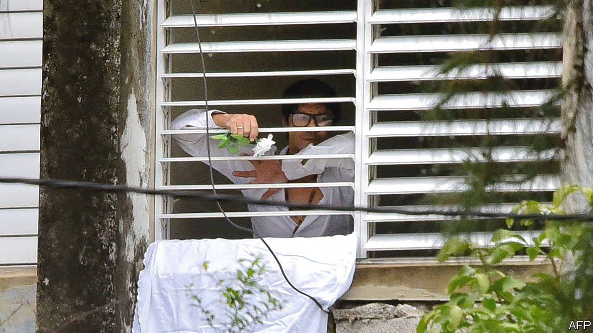

###### A rose, but no uprising

# Cuba’s government squelches a planned nationwide protest 

##### A pro-democracy movement hopes to fight another day 

 

> Nov 18th 2021 

YUNIOR GARCÍA AGUILERA, a leader of Cuba’s pro-democracy movement, had hoped to join a protest against the government on November 15th. It was planned as a follow-up to demonstrations in July. This time security forces detained activists in advance and blocked the street along which Mr García had planned to walk holding a white rose, the movement’s symbol. The protest was small. Mr García later turned up in Spain.

