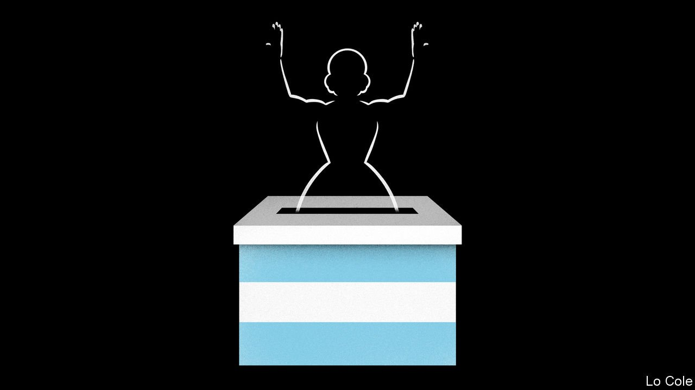

###### Bello

# Will electoral defeat favour moderation in Argentina? 

##### The ambiguities of Peronism 

 

> Nov 18th 2021 

ON THE NIGHT of a mid-term legislative election on November 14th the mood in the opposition’s campaign headquarters was oddly flat. Across Buenos Aires the governing Peronists were euphoric. President Alberto Fernández called for a rally this week in the Plaza de Mayo, scene of the movement’s past triumphs, “to celebrate victory”. In fact, the opposition won 42% of the national vote against only 34% for the Peronists. The celebration was because they had expected worse. That was not the only oddity: while defeat heralds two difficult years for Mr Fernández’s government, it may also make it easier for him to take some tough decisions, such as coming to terms with the IMF.

Mr Fernández, who calls himself a social democrat, governs in a loveless political marriage with his vice-president, Cristina Fernández de Kirchner (no relation). She is a leftist populist who offered him the top place on the Peronist slate for the presidential election in 2019. In some ways it was she who was the big loser this time. The Peronists lost their majority in the Senate for the first time since democracy was restored in Argentina in 1983. Although they remain the largest party, Ms Fernández, who as vice-president chairs the upper chamber, can no longer dictate its agenda. Humiliatingly, the Peronists came third in Santa Cruz, her adopted home province in Patagonia, long a family fief.


The election may mark the beginning of the end of kirchnerismo, the politically ductile but economically intransigent grouping that Ms Fernández, who was president for eight years after succeeding her husband in 2007, turned into the dominant force within the Peronist movement. She has thwarted Mr Fernández’s inclination to deal with the IMF, to which Argentina owes $43bn. Her response to Peronism’s crushing defeat in primary elections in September—in Argentina these function as a dress rehearsal, since all parties must hold them on the same day—was to order more government spending on subsidies and handouts.

“They copied the worst practices in Argentine politics,” says Sergio Berensztein, a political analyst. The government funnelled money into the conurbano of Buenos Aires province, the mainly poor suburbs that are home to one in four Argentines and are Ms Fernández’s political heartland. This went not just on handouts but also on paving roads in muddy settlements that still lack sewers and piped water. One poll found that those who received government aid were more likely to have voted for the Peronists. The result was that they gained 460,000 more votes in the province than in September. But that was still 2m fewer than in 2019, and the opposition won, albeit narrowly.

This relationship with poorer voters has been Peronist practice ever since Eva Perón held court in the 1950s, handing out public-sector jobs. The scope for it is narrowing. Some 17m people (four out of ten) depend on the state for their income, through benefits, pensions or public employment. The result is persistent fiscal deficits. Since the IMF suspended disbursements to Argentina in 2019 these are financed mainly by printing money, stoking inflation.

Unless it negotiates a new loan, the government must repay $21bn to the IMF over the next 13 months. The Central Bank’s reserves do not come close to that. So the government faces a stark choice: default, triggering yet another flight from the peso, or make a deal. “It’s time to resolve the problem,” Mr Fernández said in a pre-recorded announcement on election night, adding that he would send an economic programme to the new Congress in early December, something he had previously claimed was unnecessary. He said the government would seek the opposition’s support.

The IMF is likely to accept a less-than-rigorous programme, but it will have to include some reduction of the deficit. That has hitherto been anathema to Ms Fernández. The proposed programme is “a political decision that has the full backing” of his whole coalition, the president said pointedly. He can probably count on the support of Peronist provincial governors and the main trade-union confederation. But Ms Fernández still has “influence and veto power”, according to Mr Berensztein.

In 2001 a non-Peronist government was toppled by rioting after it imposed austerity and lost a mid-term election. The Peronists still control the streets, and can probably muddle through until the next election in 2023. But they have no project for the future. That is Argentina’s biggest problem.

