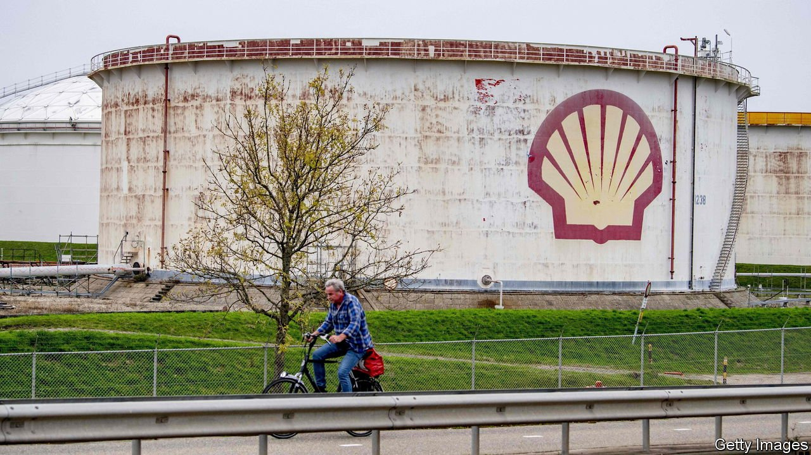
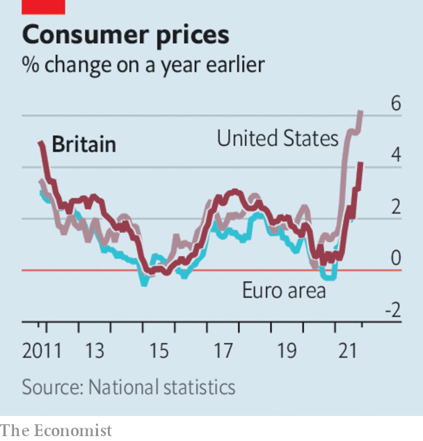

###### The world this week

# Business 

#####  

 

> Nov 18th 2021 

Shell  to its corporate structure, with plans to move its tax residency from the Netherlands to Britain, dump its dual-share structure and remove the legacy “Royal Dutch” from its legal name. The oil giant is under pressure to increase returns to investors. Relocating its tax base to Britain gives it more freedom on share buy-backs. Shell is keeping several big divisions, such as global upstream, in the Netherlands. Nevertheless the Dutch government said it was “unpleasantly surprised” by the news.

Toshiba laid out formal proposals to split into three publicly listed companies, a move that came soon after General Electric’s similar decision to split. The Japanese conglomerate wants to house its nuclear, infrastructure and engineering businesses in one company, create an asset-management firm that will oversee its tech holdings in another, and start a new company for its chips and small devices. Some shareholders want Toshiba to sell itself to a private-equity buyer instead.


Meanwhile, Johnson &amp; Johnson, another huge conglomerate, said it would spin off its consumer-health division into a separate business, leaving it to focus on pharmaceuticals and medical devices.

Natural-gas prices surged in Europe again, after Germany’s energy regulator temporarily suspended its certification of the new Nord Stream 2 pipeline, which is to transport Russian gas to western Europe. More Russian supplies would ease the continent’s energy crunch, but the regulator said that the pipeline’s operator was not in a “legal shape compliant with German law”.

Japan’s economy shrank by 0.8% in the third quarter compared with the previous three months, a blow for Kishida Fumio, the new prime minister, ahead of his announcement of a big stimulus package. Business investment plunged in the quarter, as global supply-chain problems hit the country’s exporters. Consumer spending also fell amid a resurgence of covid-19.

 


Britain’s annual inflation rate jumped to 4.2% in October, the highest level in a decade and up from 3.1% in September. This was mostly because of higher energy costs and supply-chain shortages, but a tightening labour market has added to inflationary pressures. The number of people in employment rose sharply in October,  that many of the 1m still on the government’s furlough scheme, which ended in September, would lose their jobs. Record job-vacancy rates persist, which often leads to higher wages to attract staff.

Joe Biden accused oil and gas companies of “anti-consumer behaviour”, alleging they were ramping up petrol prices for profit, and asked the Federal Trade Commission to investigate. The president is under political pressure as a result of surging prices at petrol pumps.

What supply-chain crisis?

Walmart  for sales, and said its shelves would be fully stocked for the Christmas shopping season. The retailer has found that shoppers are gradually returning to pre-pandemic habits, with more of them visiting physical stores than a year ago. Target issued a similar earnings report.

Just a week after its IPO, Rivian, a maker of electric vehicles backed by Amazon, reached $153bn in market capitalisation, overtaking Volkswagen in value. Its share price then dived by 15%, wiping out its lead over VW. Lucid, which produces luxury electric cars, passed Ford in market value. Rivian and Lucid have yet to make a profit, but investors are betting that the companies’ shares will perform as well as Tesla’s, though they could also be as volatile.

The British government ordered a full investigation into Nvidia’s proposed acquisition of Arm, a British chip-designer, in part on national-security grounds. Nvidia, America’s most valuable semiconductor manufacturer, later revealed that America’s Federal Trade Commission has “expressed concerns” about the deal, which is also being investigated in the European Union.

AstraZeneca is looking to make “modest” profits from new orders of its covid-19 vaccine. The drugmaker produced its vaccine in collaboration with Oxford University, and has been selling it without a profit margin (unlike rival firms). Its doses have been used mostly in Europe, but also in developing countries, where it will still be sold at cost.

The right to be disconnected

News sites pored over the recent approval of a law in Portugal that bans employers from contacting their staff outside working hours, including by email. Companies will also have to pay some of the cost of remote working, such as an employee’s higher energy bills, and cannot monitor home workers in any way. Office workers in Portugal have nothing to lose, it seems, but their email chains.

