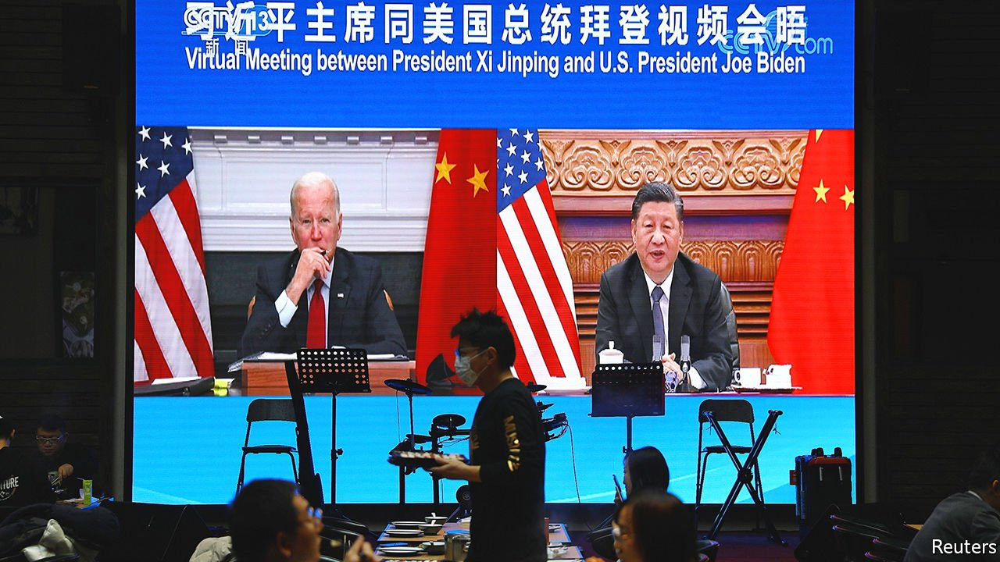
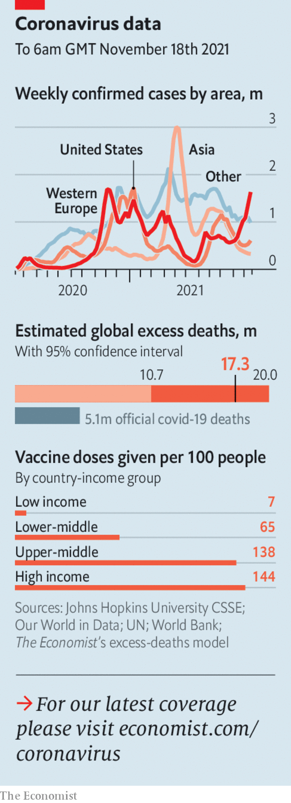

###### The world this week

# Politics 

#####  

 

> Nov 20th 2021 

America’s president, Joe Biden,  by video link with his Chinese counterpart, Xi Jinping. It was the closest thing to a meeting between the two men since Mr Biden took office in January. Mr Xi told Mr Biden that he was ready to “take active steps” to improve relations between China and America. Mr Biden called for co-operation “where our interests intersect”, including on climate change. America’s national security adviser, Jake Sullivan, said the two leaders had agreed to “look to begin to carry forward discussions on strategic stability”. He appeared to mean that America and China would explore talks on nuclear-arms control.

A court in Hong Kong sentenced Ma Chun-man to nearly six years in prison for violating the territory’s national-security law by chanting slogans calling for the territory’s independence. Mr Ma is widely known as Captain America because he held a shield like the superhero’s at protest rallies.


Russia conducted an anti-satellite missile test that blew up one of its own satellites. The debris it created forced the crew of the International Space Station to take refuge in safety capsules. Worldwide .

At least 2,000 migrants remained trapped at the Belarus-Poland border. EU countries have managed, however, to persuade several airlines to stop ferrying people from the Middle East to Belarus, where they have been lured by the Belarusian dictator’s false promise that they will be given refuge in the West.

Spooked by rising covid-19 hospitalisations, Austria introduced a lockdown for anyone over the age of 12 who has not been fully vaccinated. About 2m people are affected. Austria has one of the lowest vaccination rates in western Europe. Germany is considering new restrictions; in Saxony the unvaccinated have already been barred from non-essential shops and other locations.

After a lengthy investigation, the Manhattan district attorney’s office moved to exonerate two of the men convicted of assassinating  Malcolm X in 1965. The DA found that prosecutors, the FBI and the police withheld evidence that would have acquitted the two men, who were released in the 1980s (one has since died). A third man confessed to the murder and spent 45 years in prison.

An American journalist was released from jail in Myanmar on “humanitarian grounds”, a few days after he had been sentenced to 11 years for unlawful association and other charges. Danny Fenster is one of the lucky ones. Dozens of Burmese journalists have been detained since the military coup in February.

November 30th was set as the date for the verdict in the closed-door trial of Aung San Suu Kyi, Myanmar’s deposed leader, on a range of charges including corruption and breaking secrecy laws. The ruling junta has also laid new charges against Ms Suu Kyi of fraud in last year’s general election, which her party won.

It’s a families affair

Sara Duterte, the daughter of the president of the Philippines, Rodrigo Duterte, announced her , disappointing her father who had hoped she would run to be his successor. In the election, due in May, she will be allied with Ferdinand Marcos junior, the son of a former dictator, who is running for president (the vice-president is elected separately). The late Marcos senior was overthrown in 1986 amid huge “People Power” protests.

Saif al-Islam Qaddafi, a son of the Libyan dictator who was toppled and killed in 2011, registered as a candidate for next month’s presidential election. He is wanted on charges of war crimes by the International Criminal Court.

A government panel found that the Nigerian army shot dead at least 11 peaceful protesters in Lagos last year. The victims were taking part in a rally against police brutality. The finding contradicts the government’s claim that no massacre occurred.

At least 53 people were killed when jihadists attacked a security post in Burkina Faso. On the other side of Africa four people were killed and many more wounded by two  in Kampala, the capital of Uganda; an affiliate of Islamic State claimed responsibility for that attack.

 


Cuba’s government arrested and threatened dissidents ahead of a planned nationwide “civic march for change” in the communist state, thereby suppressing the protest. Dissidents had hoped to match big demonstrations in July. Hundreds were arrested then.

Argentina’s ruling Peronists lost control of the Senate for the first time since 1983. In mid-term elections the opposition won 42% of the national vote compared with 34% for the Peronists. This was seen as a rebuff to the leftist-populist vice-president, Cristina Fernández de Kirchner. The results might help the not-so-populist president, Alberto Fernández, strike a deal with the IMF over a debt of $43bn.

Sixty-eight inmates were killed amid gang warfare in a prison in Guayaquil, a city in Ecuador. In September 119 convicts were killed in the same jail. The heads of Ecuador’s prisons and its armed forces resigned after the latest violence.

Something for everyone

The COP26 conference on climate change came to an end. The final agreement called for further pledges to reduce emissions next year to try to put the world on track to limit warming to 1.5°C. There were side-deals on methane, forestry and cars. Rich countries promised, again, to provide more aid to poor ones to adapt their economies, but a plan to compensate developing countries for the impact of global warming . India led a push to water down a commitment to end coal power.

Nine members of Insulate Britain, a green protest group, were jailed for three to six months for defying court injunctions not to block busy roads. The group’s zealous tactics have made life even more miserable for London’s already frustrated drivers. The judge said there was no alternative to prison for the nine, given their intention to keep flouting the injunctions.

