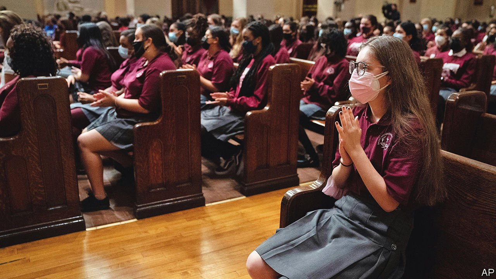

###### Answered prayers

# America’s Catholic schools are seeing a surprising rise in enrolment 

##### Despite empty pews and sexual-abuse scandals, Catholic education is increasing in popularity 

 

> Nov 20th 2021 

“I NEVER ENVISIONED sending my children to a Catholic school. I have a good public school down the block from my house,” says Laura Camisa, mother of two girls aged five and seven. She and her family live in an expensive Brooklyn neighbourhood in a high-performing school district. Ms Camisa’s older daughter was in kindergarten when schools shut down in 2020 because of the pandemic. Remote learning was difficult for her daughter. Once happy and outgoing, she became withdrawn. “This is not working”, Ms Camisa remembers saying to herself. After hearing good things about St Joseph the Worker, a nearby Catholic school, she decided to send her children there.

The Camisas are one of thousands of families newly enrolled in Catholic schools. Falls in pupil numbers of a couple of percentage points a year had been the norm for years. The number had fallen from a peak in the early 1960s, when Catholic schools had 5.2m pupils, to around 1.6m last year, which meant a lot of empty desks. But this autumn dioceses all over the country are seeing increases in enrolments. The National Catholic Educational Association is still collecting and analysing the latest pupil data, but its preliminary numbers show increases in most dioceses.


The Brooklyn-Queens diocese in New York, one of the biggest in the country, is saw increases for the first time in a decade or more. Nearly 60% of its schools are growing, with many increasing by 10%. Partnership Schools, a network of Catholic schools in New York City and in Cleveland, saw a 16% increase. The diocese of Springfield, in Massachusetts, is up by 13%. Arlington’s diocese, which takes in the suburbs of Washington, DC, increased by 6%. The Archdiocese of Baltimore, the county’s oldest, saw a similar increase. Chicago’s archdiocese, which includes some suburbs, saw a 5% increase. Enrolment increased by nearly 4% in Catholic elementary schools in Philadelphia’s archdiocese.

Why are Catholic schools suddenly growing? Last autumn many public-school systems  and did not offer full-time in-class learning. When Catholic schools reopened, most provided in-person learning. This appealed to families who struggled with remote learning—many of the new pupils are children whose parents cannot work from home. Most Catholic schools had plenty of space to socially distance: those empty classrooms came in very handy.

Families took note, including non-Catholics. In 1970 only 2.7% of the pupil population was non-Catholic. Last year it was one in five. In some dioceses it neared two in five. Kathleen Porter-Magee, superintendent of Partnership Schools, says the children in her Cleveland schools are nearly all non-Catholic: “We like to quote the late Cardinal Hickey of the Archdiocese of Washington who said, ‘We educate our communities, not because they are Catholic, but because we are’.”

Catholic superintendents and enrolment directors are giddy about the increase. Mary Pat Donoghue of America’s Conference of Catholic Bishops hopes it will stabilise the pupil population. Father Joe Corpora of the University of Notre Dame warns: “We’ll never get another chance like this again.” Some dioceses and schools are working on retention and marketing plans, a first for many.

Catholic schools are not cheap. Tuition averages $4,800 a year for elementary schools and high school costs more than $11,000. Historically, parishioners helped offset tuition costs with what they put in the offertory basket. But as fewer people went to church, that funding stream decreased. The many sexual-abuse scandals have also hurt enrolment. Charter schools, which share some of the attributes of Catholic ones (uniforms, discipline, community values) also drew prospective pupils away from Catholic schools. It is hard to compete with free.

Even so, many families are willing to pay. Ms Camisa and her husband have had to rejig their finances to afford tuition. “We moved [schools] because of the pandemic, but we stayed because of what we saw at St Joe’s.” When public schools restored in-person learning, she did not return. “We’ll probably stay Catholic the whole way to high school.” ■

For exclusive insight and reading recommendations from our correspondents in America, , our weekly newsletter.

