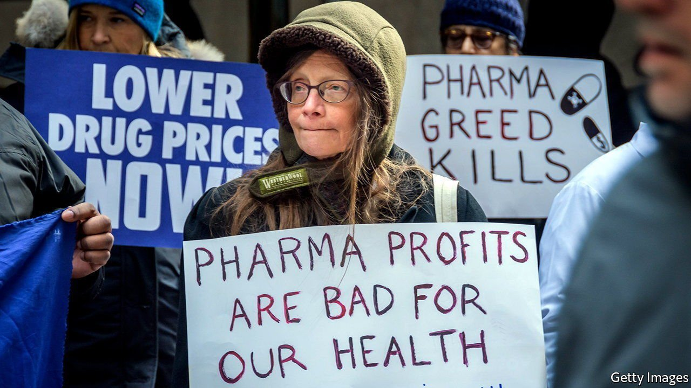
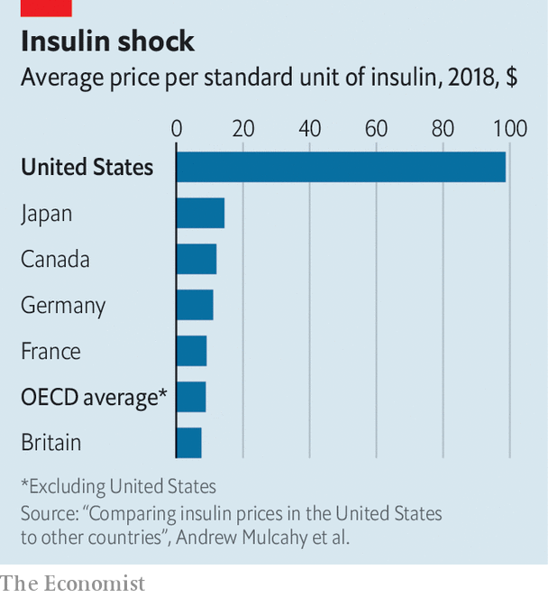

###### Drug deals

# Democrats have a plan to lower drug costs without hurting innovation 

##### The party’s latest legislative proposal would bring the cost of medication more in line with the rest of the world 

 

> Nov 20th 2021 

MOST DIABETICS need at least one shot of insulin a day to regulate their blood-sugar levels. Some need four, and in America, drug companies charge about $100 a vial—nearly seven times more than in any other OECD country. Older Americans, a third of whom live with diabetes, could soon pay as little as $35 a month thanks to a bill that the Democrats are trying to fast-track through Congress, much to the dismay of the pharmaceutical industry, which argues that the cost caps will damage innovation.

Prescription drugs in America cost two and a half times more on average than in other developed countries. At the moment the federal government cannot negotiate with pharma firms over the prices of the drugs they sell, as other countries do. In Britain, for example, the NHS negotiates discounted prices with pharmaceutical companies, and only after another public body has determined if a drug is beneficial enough to justify the price. In America, pharmaceutical companies are, in effect, the price makers. If passed, this bill would allow the government to have some say in drug prices for the first time.

 


On behalf of Medicare patients (those aged 65 or older and the disabled), the bill could empower the health secretary to negotiate lower prices for ten of the costliest drugs by 2025 and 20 by 2028. This includes treatments typically given in hospitals, such as cancer drugs which can cost payers $20,000 a dose, and also prescription drugs taken at home. The plan would also ensure that these patients don’t spend more than $2,000 of their own money on medicine each year, a desirable development since an estimated 18m Americans can’t afford the drugs that they need.


This is, unsurprisingly, not popular with the pharmaceutical industry. Many new drugs developed today rely on venture-capital investments in small biotech firms to carry out risky research. Investors are incentivised by the promise of substantial returns, since America’s pharmaceutical behemoths eventually sell these drugs at high prices. The plan before Congress also curbs pharmaceuticals from increasing some of their drug prices more than the rate of inflation each year. This sounds good for consumers, but PhRMA, the industry’s lobbying group, maintains that this bill will up-end America’s “global leadership in biomedical innovation”. Will it?

Although high prices can subsidise research, the bill has been tweaked to reduce the impact on new drugs. The Democrats’ previous proposal would have introduced price negotiations and inflation caps for 250 drugs, for everyone. Had this been made law, the non-partisan Congressional Budget Office estimated that eight fewer drugs would have been brought to market over a decade (which is either a little or a lot, depending on your medical prognosis). But in the current plan, only ten of the costliest drugs will be affected at first by inflation caps. What is more, these caps will apply only after the drugs have been on the market for a while: nine years for cheaper small-molecule drugs and 12 years for the more complex biologics.

Pharmaceuticals and their investors often make their money back, and then some, much faster than this. Take Gilead Sciences, for example, which bought the biotech Pharmasset—and their Hepatitis C drug, Sovaldi—for $11.2bn in 2011. Gilead recouped almost all of that in 2014 alone. In short, the bill strikes a balance that minimises innovation risks while still granting the government some much-needed negotiating power. Even the representatives most critical of drug-pricing reforms, such as Senator Kyrsten Sinema, seem to have come around.■

For exclusive insight and reading recommendations from our correspondents in America, , our weekly newsletter.

