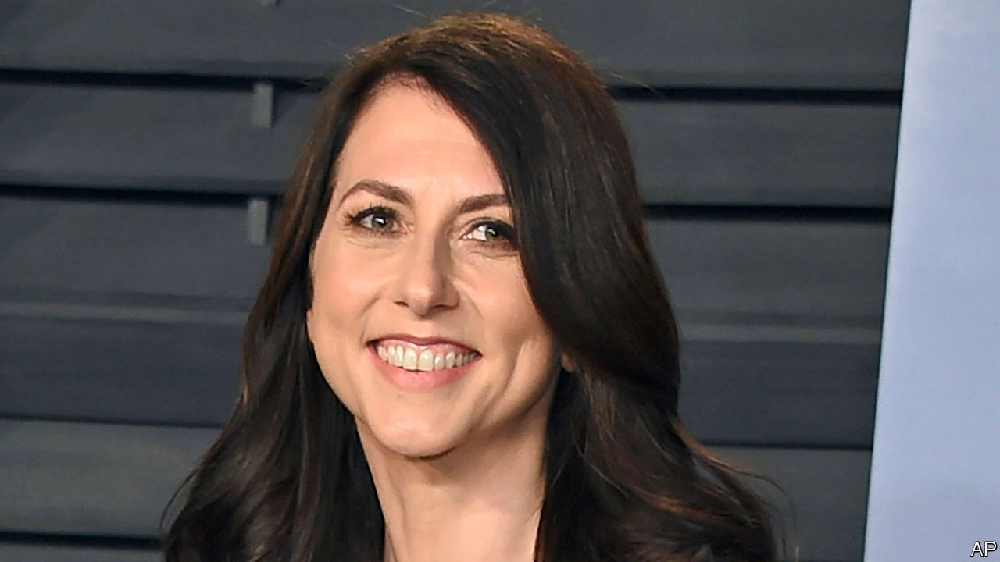
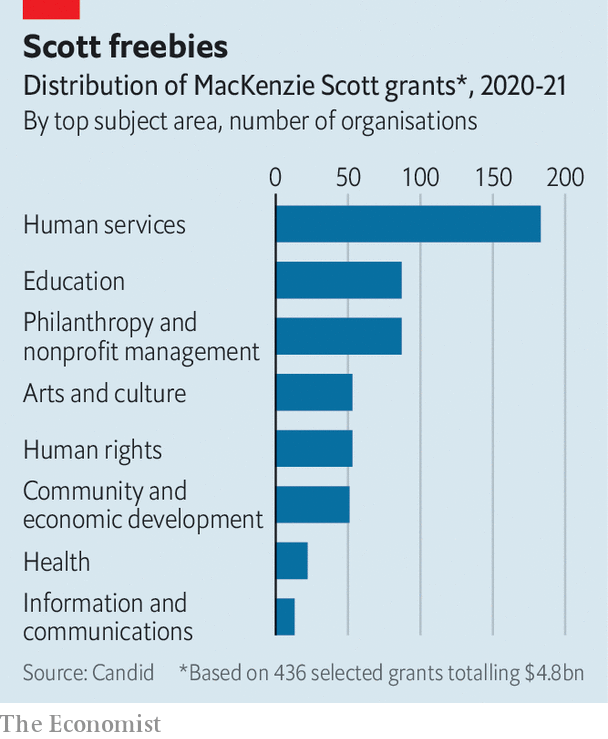

###### Scott free

# MacKenzie Scott is giving away more money, faster, than anyone has before 

##### But America’s champion philanthropist operates like a middle-class donor 

 

> Nov 18th 2021 

IN JUNE 2020, Jorge Valencia of the Point Foundation started receiving calls and emails from consultants doing due diligence on his organisation, which helps lesbian, gay, bisexual, transgender and queer (LGBTQ) students into higher education. They wanted financial statements and asked questions about how the group was responding to the pandemic. For a non-profit organisation that relies on donations, it was nothing out of the ordinary.

What came next, however, was. Just a few weeks later they received another call, this time with news that MacKenzie Scott, the former wife of Jeff Bezos, who founded Amazon, wanted to make a large gift. There were no restrictions on how the money was to be spent or plans to monitor the group’s work beyond a short annual report—just a request to keep quiet about the source of the donation for a few weeks. Mr Valencia will not disclose how much money Ms Scott gave. But, in the midst of a pandemic, as many non-profit groups are worried about funds drying up, it has allowed the Point Foundation to more than double the number of young people it helps this year. “It was a godsend,” Mr Valencia says.


Ms Scott is an unusual billionaire. A novelist by trade, she came into a vast fortune when her 25-year marriage to Mr Bezos came to an end in 2019. As a result of the blockbuster divorce settlement she has become the 22nd-richest person in the world, with a net worth of around $60bn. Yet she is, by all accounts, an understated sort. She has married a science teacher at the school her children attend in Seattle and signed the Giving Pledge, promising to devote most of her wealth to giving back. Her only comments on her philanthropy so far are contained in three short blog posts sprinkled with references to poetry by Rumi and Emily Dickinson.

That discretion masks immense power. Over the course of the pandemic Ms Scott has become one of the most generous philanthropists in history, announcing $8.6bn in gifts in the 12 months to June. That is widely thought to be the largest sum anyone has ever given to operating charitable groups in such a short period. Other wealthy people tend to give to foundations, which then disburse grants over time. , the largest private development foundation in America, for example, dished out $5.8bn in 2020.

Ms Scott is also exceptional for the way she donates. Most “mega donors” today take a technocratic approach. They set up a foundation, put potential grantees through a gruelling application process, fund specific projects and monitor them closely. Ms Scott is giving the way middle-class people do: donating to a bunch of organisations and leaving them to get on with their work. As Benjamin Soskis at the Centre on Non-profit and Philanthropy at the Urban Institute, a think-tank, puts it: “Her fundamental priority is getting money out the door.”

 


The first big decision rich people make when they decide to give money away is who to give it to. Here Ms Scott has relied on outside advisers, including The Bridgespan Group, a non-profit consultancy spun out of Bain and Company, rather than setting up a permanent bureaucracy of her own. The approach she has settled for involves spraying funds across relatively small organisations working on a wide range of concerns, including .

A good chunk of Ms Scott’s gifts have gone to local groups in America, such as food banks and YMCAs. Bloomberg News sent a survey to the recipients of all 786 gifts and got responses from 270. They found that half, excluding colleges and universities, have fewer than 50 employees. For nearly 90% of them, Ms Scott’s donation is the largest they have ever received. Contrast that with the Gates Foundation, which has handed about 30% of its total funding over the past two decades to ten big international groups, including the World Health Organisation; Gavi, the vaccine alliance; and the Global Fund to Fight AIDS, Tuberculosis and Malaria.

The second step is deciding how to dish out money. Here, Ms Scott’s decision to make unrestricted grants is particularly popular with beneficiaries. The leaders of non-profit organisations grumble that donors too often tie money to specific projects, leaving them struggling to finance day-to-day operations. One-third of groups that received funds from Ms Scott are using the money to hire more people and over a fifth plan to invest in technology, according to the Bloomberg poll.

Ms Scott likes to fund people with personal experience of the problems they are trying to solve. The Interfaith Youth Core, for example, which received a $6m gift, was founded by Eboo Patel, an Indian-American Ismaili Muslim. The Chicago-based non-profit has decided to use some of the money to launch an online magazine that writes about subjects such as Jewish baseball players and voodoo festivals in Haiti. Implicit in Ms Scott’s unfenced giving, Mr Patel says, is a recognition that the person with the money doesn’t necessarily know best. “It makes the recipient feel honoured and dignified,” he says.

The third step is how to evaluate what organisations do with the money. Ms Scott has said little about this, but here too, grantees say, she takes a light-touch approach. One, the National Centre for Family Philanthropy, has been asked to submit a “simple and brief” report every year for the next three years that lays out what the organisation is up to. There is no template for that report and no effort to advise the organisation along the way. Ms Scott has coined a term for this approach: “seeding by ceding”.

Whether it was her intention or not, Ms Scott has issued a challenge to the bureaucratic, top-down model that has dominated American philanthropy for decades. It already seems to be influencing other rich people. Ms Scott’s ex-husband, for example, is chided for refusing to sign the Giving Pledge and being slow to make donations. But when Mr Bezos landed back on Earth after his first trip into space earlier this year, he announced a £200m gift that was a surprise to the recipients and came in the form of unrestricted grants. “No bureaucracy,” he said.

None of this is to say that Ms Scott has found some magic formula. In pursuit of discretion, she forgoes transparency. She has kept her advisers secret, so non-profit leaders eager to get on her radar have no way to contact her, aside from commenting on her blog. There are so many con artists pretending to dole out cash on her behalf that Ms Scott’s Twitter bio directs victims to a Federal Bureau of Investigation complaints page. And because she is giving as an individual, she doesn’t face the same reporting requirements as a foundation. Rob Reich at Stanford University points out that this opacity is rare among big donors. “It is insulting to democratic citizens because of the kind of power she wields,” he thinks.

Of course, Ms Scott’s strategy could change. She is just getting started with her philanthropy. Even as she announced her first round of grants last year, she vowed “to keep at it until the safe is empty”.

That could be more difficult than it sounds. The source of her fortune is a 4% stake in Amazon she received as part of the divorce settlement in April 2019. Shares in the e-commerce giant have rallied some 95% since then. Ms Scott’s safe is fuller now than it was when she began shovelling money out of the door.■

For exclusive insight and reading recommendations from our correspondents in America, , our weekly newsletter.

An early version of this article was published online on November 16th 2021

