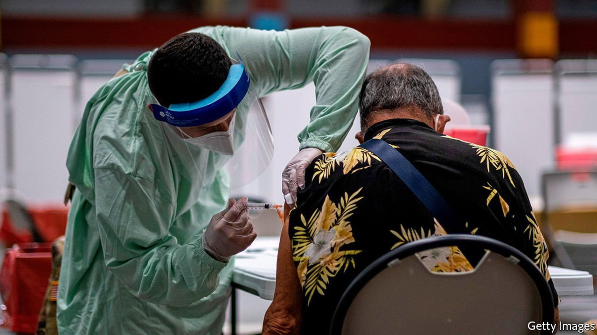

###### Where did it all go so right?

# Puerto Rico, success story 

##### How an impoverished, battered island handled covid-19 better than the us 

 

> Nov 18th 2021 

HURRICANE MARIA killed about 3,000 people and left parts of Puerto Rico without electricity for 11 months after it made landfall in September 2017. For the past four years its inhabitants have endured frequent electricity blackouts. Then earthquakes then hit the island in late 2019-early 2020. So when the first covid case was documented two months later, Puerto Rico was still reeling from previous disasters. The hospital system was in disarray: about 15% of medical personnel fled for the mainland after Hurricane Maria, and the earthquakes forced many clinics to close. Some Puerto Ricans were living in tent shelters, where infectious diseases could spread easily. Many feared that covid would devastate the weakened island.

In fact Puerto Rico, an American territory of 3.3m people about 1,000 miles (1,600km) south-east of Florida, has fared much better than most of America. The island experienced lower infection rates per person than all American states (5,843 cases per 100,000 since January 21, 2020). Of course, low case rates could be the result of infrequent testing. The positivity rate (the percentage of covid tests that are positive) is used as an indicator of how widespread infection is and whether enough testing is being done. As of November 15th, Puerto Rico’s positivity rate was 5-7.9% for the entire pandemic, just slightly above the share at which the World Health Organisation thinks the virus is under control.


Since January 2020, Puerto Rico saw 3,258 deaths from covid-19 (102 deaths per 100,000 people). Of the American states, only Vermont (60), Hawaii (68) and Maine (92) had fewer deaths per person. This is despite the fact that the island’s demography does not work in its favour. Over one-fifth of Puerto Ricans are 65 or older, compared with 16% of Americans overall. Those with pre-existing conditions are also at greater risk of severe covid infection, and Puerto Rico is over-represented among these diseases. It is also four times poorer than the rest of America: 44% live in poverty.

Why has Puerto Rico done so well? Unlike much of America, the island enacted strict rules early. The government brought in a lockdown in March 2020, two days after its first confirmed covid case. Non-essential businesses were ordered to close, and a curfew was enforced from 9pm until 5am. Anyone who broke it faced a $5,000 fine or a six-month jail term. “Puerto Rico…enact[ed] some very intense and very stringent protocols when covid first came out,” explains Brice Acosta, formerly of the Federal Emergency Management Agency. “I think that really helped them control things in the beginning.” Variations of this lockdown continued for over a year. When all American states (except Hawaii) reopened over the summer, Puerto Rico did not and kept many restrictions in place.

Detachment from the mainland also allowed Puerto Rico to limit travel into the territory. Cruise-ship passengers were prohibited during the pandemic, and even fully vaccinated ones were not allowed to enter Puerto Rico until August this year. In March 2020 the Federal Aviation Administration granted Puerto Rico permission to require all commercial flights to land at the international airport in San Juan for health screening before heading to other destinations. Today, all passengers landing in Puerto Rico must show proof of vaccination or a recent negative covid-19 test.

Other American jurisdictions detached from the mainland also benefited from the distance. Alaska experienced relatively few deaths per person compared with the rest of America (109 per 100,000), as did the US Virgin Islands (79) and Hawaii (68). All three limited domestic and international travel. Hawaii’s rules were particularly stringent: some tourists were arrested for breaking quarantine rules, and domestic travellers must still present a negative covid test or vaccination card to avoid having to quarantine for a stretch before paddling out on the North Shore. But despite these restrictions, each of these jurisdictions has experienced covid surges over the past few months that have overwhelmed hospitals and caused patients to be turned away. Puerto Rico did not.

Widespread vaccination is the likeliest reason for this difference. Puerto Rico is the most vaccinated jurisdiction in America. As of November 16th, 74% of the island’s population was fully vaccinated (America’s average is 59%). Hawaii, Alaska and the Virgin Islands have struggled to vaccinate their populations, with 60%, 54%, and 47% of residents vaccinated respectively. Victor Ramos, a doctor who is president of Puerto Rico’s association of physicians and surgeons, credits a strong childhood-immunisation system for the successful covid-19 campaign. He is confident that Puerto Rico will also successfully vaccinate eligible children over the coming months. For America, it is a glimpse of what might have been. ■

For exclusive insight and reading recommendations from our correspondents in America, , our weekly newsletter.

Dig deeper

All our stories relating to the pandemic can be found on our . You can also find trackers showing ,  and the virus’s spread across .

