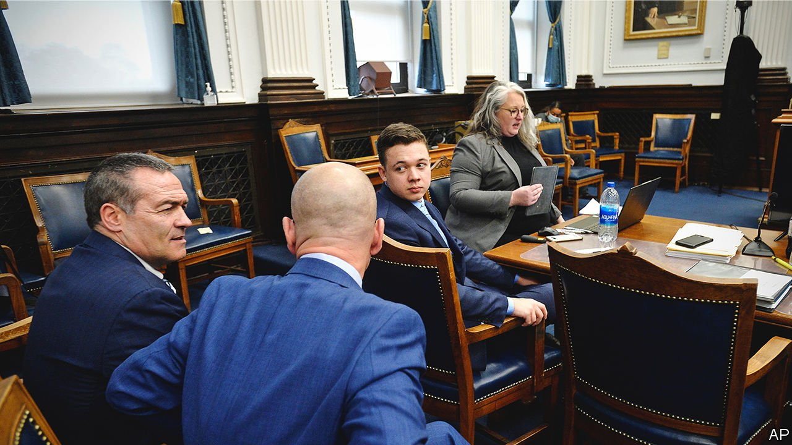

###### Provoking questions

# The trial of Kyle Rittenhouse shows America’s divide over guns 

##### This will not be the last tense trial on the topic of self-defence 

 

> Nov 20th 2021 

THE TRIAL of Kyle Rittenhouse, an 18-year-old from Illinois who killed two people after a Black Lives Matter protest in Kenosha, a small city in Wisconsin, last August, ended much as it began: with people pointing guns. In the concluding arguments, both Thomas Binger, the lead prosecutor, and Mark Richards, the lead defence lawyer, took Mr Rittenhouse’s rifle out of its evidence box to make their points. “He raises his left hand, to the gun, and points”, explained Mr Binger, aiming the firearm (which he had checked was unloaded) at the courtroom. “That is what provokes this entire incident.” Later, Mr Richards also took the gun out to show how, in his view, Mr Rittenhouse did not shoot Joseph Rosenbaum, the first victim, in the way the state contended.

Such were the details on which jurors had to decide in the case of Mr Rittenhouse. On November 18th, as The Economist was published, jurors were still deliberating on the charges against him, which include intentional homicide. The lawyers were arguing over video evidence, with the defence having requested a mistrial. The trial, which has taken over two weeks, highlights deep divisions among Americans over gun ownership and what constitutes acceptable self-defence.


Most of the facts of the case were well known long before any witness took the stand. After a night of rioting that followed the shooting by police of a black man, Jacob Blake, Mr Rittenhouse, who was 17 at the time, travelled to Kenosha to volunteer to defend businesses from looters. He took with him an AR-15 style semi-automatic rifle he had paid a friend, Dominick Black, to purchase for him (he was too young to buy it himself). A little before midnight, he became separated from the group he had joined and ended up being chased by Joseph Rosenbaum, a troubled 36-year-old, who he shot four times. He then tried to flee and, having fallen over, shot two more people who ran after him, killing one, Anthony Huber, who had been hitting him with a skateboard, and injuring another, Gaige Grosskreutz, who had been approaching him with a gun in hand.

Almost all of it was recorded on video tape, by security cameras, witnesses’ mobile phones, and, crucially to the prosecution’s case, an FBI drone. What the jurors had been asked to decide was how to interpret that evidence. Was Mr Rittenhouse, as alleged by the prosecution, a naive “chaos tourist” who went to Kenosha to play at being a vigilante and then shot his way out of a scary but not actually life-threatening confrontation? Or was he, as the defence argued, a well-meaning young man who set out to help and was ambushed by unhinged, criminal rioters, who he was forced to shoot? “If I would have let Mr Rosenbaum take my firearm from me, he would have used it and killed me with it and probably killed more people”, claimed Mr Rittenhouse on the stand. Mr Binger argued that Mr Rosenbaum was in fact the one threatened, by the rifle.

Earlier in the trial, Bruce Schroeder, the judge, had stressed that the decision was “not a political trial”. Yet in his jury instructions, he also specifically told them to “pay no heed to the opinions of anyone—even the president of the United States or the president before him”. During last year’s election campaign, Joe Biden posted a video that implied that Mr Rittenhouse was a white supremacist (others called him a “domestic terrorist”). Donald Trump by contrast suggested he was only defending himself.

Ultimately, politics is hard to avoid in cases like this, because the law asks a jury to decide what is a “reasonable” use of a gun, says Samuel Buell of Duke University. That is not something most Americans agree on. In the past decade or so, the “open carry” of weapons, particularly to sensitive events such as protests, has burgeoned, led by right-wing pro-gun activists. Generally it is legal. And yet in most states, pointing a gun at somebody also constitutes an assault. The rules on what is acceptable conduct and what is dangerous are deeply unclear. America finds itself “looking to specific high profile trials as a way of trying to settle contestable social issues that the political system has failed to grapple with”, says Mr Buell.

Sadly, such trials seem sure to proliferate. Even as the jury weighed Mr Rittenhouse’s fate, lawyers in Georgia were busy fighting another case, of three white men accused of killing a black man, Ahmaud Arbery, in February last year. Like Mr Rittenhouse’s victims, Mr Arbery was also shot at close range during a physical struggle. As in Kenosha, it was filmed. And like Mr Rittenhouse, his killers also claimed that their guns could have been used against them. Whatever the verdict, no single court case will provide a good answer to the question of when shooting a person is acceptable. That is something more than 12 Americans at a time must answer. ■

For exclusive insight and reading recommendations from our correspondents in America, , our weekly newsletter.

