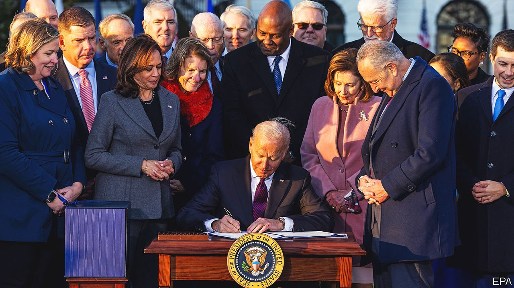

###### Spending and voting

# Will Democrats be rewarded for spending lots of money? 

##### The precedents suggest not 

 

> Nov 18th 2021 

AMERICA’S PROGRESSIVES reckon they would win more elections if only Congress would pass their left-leaning economic agenda. The presidential campaigns of Bernie Sanders and Elizabeth Warren in 2020 were animated by the idea that raising taxes on the wealthiest Americans to pay for much more spending would turn out younger and less engaged voters. A watered-down version of the same theory is being applied by some Democrats to Joe Biden’s bipartisan infrastructure bill, which allocates $550bn in new spending over the next ten years for various public-works projects and was signed into law this week. The total price-tag of $1trn is higher than the Democrats’ most recent infrastructure-focused stimulus package, Barack Obama’s 2009 American Recovery and Reinvestment Act (ARRA). Will voters be madly grateful?

Probably not. “Economic populism,” as Democratic Party staffers and strategists call the tactic, may be more white whale than silver bullet. Our analysis of US House election results in 2008 and 2012 reveals that the party did not do any better in counties that saw higher per-person ARRA funds than in those that saw less.


We looked at the change in the Democrats’ share of votes cast in competitive House races, weighing ARRA funding per person in each county against the Democrats’ share of the vote in that county in 2008, the percentage of white, non-college-educated voters living there, the number of people per square mile, the unemployment rate in 2008 and a few other factors. After adjusting for these, ARRA funding had no effect on the party’s performance. Our model found the Democrats lost 7.7 percentage points of the vote in the average county in the bottom 10% for ARRA funding, versus 7.9 points for counties in the top 10%. That difference was not statistically significant.

The findings are controversial. Past studies about the effects of the ARRA have found small positive effects for the Democrats’ vote share—with an interesting twist. The leading study was done by Katherine Levine Einstein, a Boston University political scientist, in conjunction with Kris-Stella Trump, now a political science professor at the University of Memphis, and Vanessa Williamson, a researcher at Brookings. The Economist’s model was nearly identical to theirs, but they found that funding went with a higher Democratic vote-share if that county already had very high levels of support for Democratic House candidates. But in very Republican places, they found the Recovery and Reinvestment Act funds actually hurt Democrats by up to 5 percentage points.

The difference comes down to which counties and which variables are included in the analysis. Because of the way ARRA funds were doled out, state capitals were often used as receptacles for money that would be distributed to counties later. This created an artificially high reading of per-person ARRA funds. Then, some of these counties just so happened to move less towards Republicans between 2008 and 2012, perhaps because they were large cities that tended to vote Democratic. This in turn produced an inflated estimate of the precise amount by which stimulus funds helped Democrats.

The academic model also did not adjust for population density in counties; or the share of white voters without degrees (both of which were linked to Republican gains during Barack Obama’s first term in office); or the possibility that all counties represented by Democratic legislators would have seen more backlash because Democrats held the White House. In our model, counties that elected Democratic House members in 2008 saw the party’s vote-share drop by five points more than those with Republican members. That effect was larger than for the ARRA—no matter what other variables we controlled for.

Progressive Democrats have for decades believed that their popular policy proposals and economic redistribution would win them more voters over time. But the biggest infrastructure spending plan of the past 50 years did not confer any such benefits on them. Perhaps this time will be different. But it seems unlikely.■

For more coverage of Joe Biden’s presidency, visit our dedicated  and follow along as we track shifts in his . For exclusive insight and reading recommendations from our correspondents in America, , our weekly newsletter.

